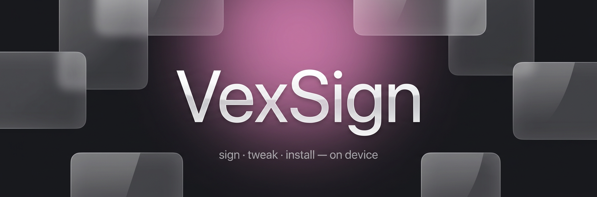
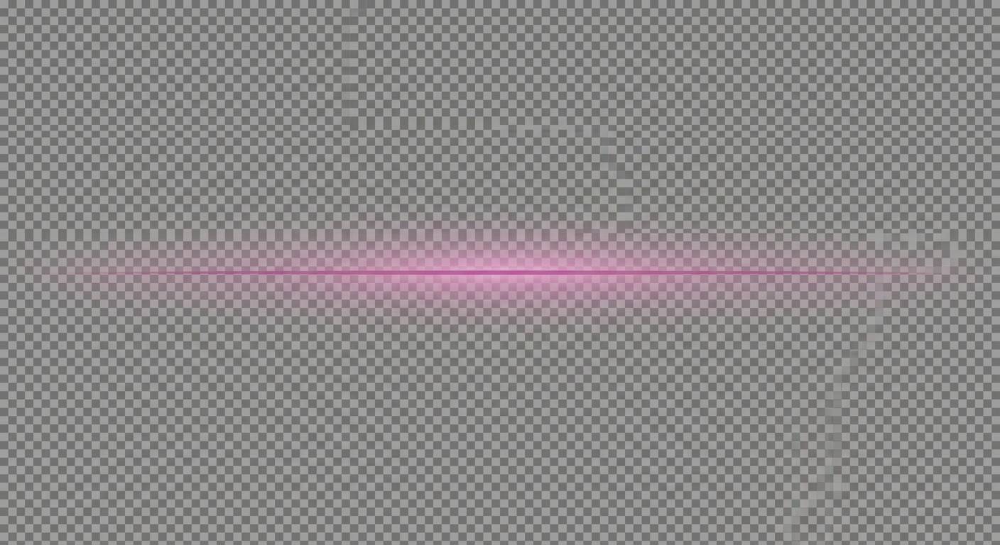

<p align="center">
  <a href="https://github.com/iamsmmh/VexSign/releases"></a>
  <a href="https://github.com/iamsmmh/VexSign/releases"></a>
  
  <a href="LICENSE"></a>
</p>

<p align="center">
  <sub>
    On-device iOS signer built on
    <a href="https://github.com/claration/Feather"><b>Feather</b></a> by
    <a href="https://github.com/claration"><b>claration</b></a> (GPL-3.0) —
    sign, tweak and install IPAs without a computer.
  </sub>
</p>

<p align="center"></p>

<p align="center">
  
  
</p>

<p align="center"></p>

## ✨ Features

Native SwiftUI with Liquid Glass support — signs and installs with `.p12` / `.mobileprovision` via Zsign, AltStore sources and certificate health monitoring included from the Feather base. On top of it, VexSign adds:

| | |
| :--- | :--- |
| 🧹 **Auto Cleanup** — import → sign → install → sweep, zero leftovers | 📂 **IPA Explorer** — edit `Info.plist`, files & images inside any IPA |
| 🧩 **Tweak Injection** — `.dylib` `.deb` `.framework` `.bundle` `.appex` via ElleKit | 📡 **File Transfer** — HTTP + WebDAV server, no cable needed |
|  **Live Downloads** — background DLs with Live Activities & Dynamic Island | 🔄 **Update All** — one-tap re-sign of every source update |
| 📦 **Batch Signing** — queue many apps with per-app settings | 💾 **Backup & Restore** — encrypted `.vexbackup` archives |
| 🛡️ **Anti-Revoke** — DoH profile pinning Apple's verification hosts | 🤖 **Automation** — scheduled updates, cleanup & summaries |
| 🗂️ **Logs + File Manager** — full console & document browser | 🎮 **Game Mode** — pauses downloads & background work |

<p align="center"></p>

## 📦 Install

Grab the latest `.ipa` from **[Releases](https://github.com/iamsmmh/VexSign/releases)**, or add this source to any AltStore-compatible signer:

```
https://raw.githubusercontent.com/iamsmmh/VexSign/main/app-repo.json
```

Installs run over a local HTTPS server (`itms-services://`) or directly via AFC pairing.

## 🛠 Build from Source

Requires **Xcode 16+**, iOS 15+ SDK, Swift 6.0.

```bash
git clone --recursive https://github.com/iamsmmh/VexSign.git
cd VexSign
make deps                    # fetch SSL certificates for the local server
open VexSign.xcworkspace     # set your team, or build unsigned with `make`
```

<sub>An optional self-hosted premium server (key validation, gated sources) ships in <a href="server/README.md"><b>server/</b></a>, deployable with one click via <a href="render.yaml"><b>render.yaml</b></a>.</sub>

<p align="center"></p>

## 🙏 Credits

| Project | Author | Role |
| :--- | :--- | :--- |
| [**Feather**](https://github.com/claration/Feather) | claration | Base — signing engine, storage layer, UI architecture, AltSourceKit, NimbleKit (GPL-3.0) |
| [**Zsign**](https://github.com/zhlynn/zsign) | zhlynn | On-device IPA signing (MIT) |
| [**idevice**](https://github.com/jkcoxson/idevice) | jkcoxson | AFC / `installd` backend for pairing installs (MIT) |
| [**ElleKit**](https://github.com/everythingappletech/ElleKit) | tealbathingsuit | Tweak injection (BSD-3) |
| [**Vapor**](https://github.com/vapor/vapor) | Vapor Team | Local HTTPS install server (MIT) |
| [**Nuke**](https://github.com/kean/Nuke) · [**ZIPFoundation**](https://github.com/weichsel/ZIPFoundation) · [**SWCompression**](https://github.com/tsolomko/SWCompression) | kean · weichsel · tsolomko | Image loading & archive handling (MIT) |
| [**backloop.dev**](https://backloop.dev/) | — | Public-CA-signed SSL for localhost |

<p align="center"></p>

## 📜 License

**GPL-3.0**, matching the Feather base — © 2026 iamsmmh (VexSign additions) · © 2024 Samara / claration (Feather).

<sub>Releases are published only on <a href="https://github.com/iamsmmh/VexSign/releases"><b>GitHub</b></a>. Sideloading may conflict with Apple Developer Program terms; use at your own risk. Not affiliated with Apple Inc. Maintained by <a href="https://github.com/iamsmmh"><b>@iamsmmh</b></a>.</sub>
