# VexSign ecosystem implementation and release plan

## Status and scope

This branch adds working feature code and cloud orchestration in parallel with the existing application. It is **not a certification that every item in the eleven-phase request is complete or production-qualified**. No original feature module or existing Python API was removed. The old signing, WebDAV, batch, widgets, shortcuts, automation, explorer, backup and OTA paths remain; narrowly scoped changes are listed below.

The new entry point is **Settings → Ecosystem**. The deployment minimum remains iOS 16. SwiftData and Observation require iOS 17: this implementation deliberately uses the existing `ObservableObject` pattern and an actor-owned SQLite cache on all supported systems. An availability-gated SwiftData/Observation rewrite is deferred; there is no duplicate persistence stack pretending to support iOS 16.

### Feature delivery matrix

| Phase | Implemented here | Remaining release/integration work |
| --- | --- | --- |
| Repository Builder | Create/edit/save/delete, file/HTTPS import, `source.json` and `apps.json` export, format selection/conversion, validation, bounded link probes, safe URL/screenshot fixes | Format support is the common public JSON subset. Encrypted ESign stays in existing AltSourceKit. Arbitrary custom field mappings, marketplace-specific validation, and provider conformance fixtures are not implemented. |
| Discovery | Existing repository parser/auth reuse, durable offline index, full-text multi-term matching, suggestions, favorites, source-qualified identity, featured/recommended/local trending, categories, collections, recently updated, cards/carousels | No global popularity telemetry or curated editorial service. Trust input is a model signal (neutral default), not a verified reputation service or editable trust dashboard. Search uses an in-memory normalized index, not SQLite FTS. |
| Certificate Health | Profile payload and entitlement viewer, team/profile expiry/countdown/device/bundle scope, push/debug entitlement reporting, local SecTrust OCSP, score and status colors, opt-in best-effort daily checks/alerts | CMS payload extraction is explicitly not CMS authentication. OCSP/device behavior needs Apple-platform testing. Profile expiry is not separately extracted certificate expiry. JIT availability cannot be inferred from a profile; UI does not claim that it can. |
| OTA | Swift plist/link/QR generator and export; backend HTTPS install pages, copy link, QR, optional images/screenshots/changelog, manifest/download endpoints and API aliases | A real HTTPS host, valid signed IPA, and device acceptance testing. Native view exports a manifest; it does not upload to or configure your cloud deployment. |
| Cloud signing | Fastify/TypeScript API, JWT ownership/rate limiting/audits, PostgreSQL schema, atomic batch/idempotency, BullMQ outbox/recovery, private encrypted S3, worker protocol, webhook retries, OTA capabilities | **No bundled signing engine/sandbox launcher or native cloud client/account UI.** Requires real services, a verified pipe-aware signer integration, infrastructure isolation and end-to-end tests. Not a turnkey signing service. |
| Repository sync | Actor-coalesced conditional HTTPS/ETag/Last-Modified refresh, SHA256 unchanged-body detection, SQLite snapshots; existing source loader gains six-hour freshness and keeps last good sources on failed refresh; opt-in startup/background refresh | No invented server delta protocol: conditional HTTP avoids downloads, otherwise full feed replacement. Background time is scheduled by iOS, not guaranteed every six hours. General source refreshing retains the established AltSourceKit pipeline rather than moving every legacy source into the new conditional-fetch service. |
| Analytics | Local daily buckets, daily/weekly/monthly Swift Charts, confirmed signing/install hooks, added cert/source events, requested enabled tweak counts on successful runs, current cert/storage gauges | No retroactive metrics, global analytics or inference that OTA handoff equals install success. Deferred-save bulk repository adds are not counted yet. Tweaks are configured injection units, not independent Mach-O patch verification. |
| Clone Wizard | Library selection, 1–20 collision-avoiding numbered clones, unsigned registration, root/nested ID rewrites, display names, PNG icon badge when a writable icon is present, existing clone API preserved | One source app per run (multi-source selection deferred). Asset-catalog-only icons and all icon variants are not rewritten. Entitlements/app groups/push domains still need matching signing options/profile. |
| UX | SwiftUI materials, hero section, async icons, lazy cards/carousels, skeleton state, native navigation/search, accessible labels | Not an app-wide iOS 26 redesign. Full Dynamic Type/VoiceOver/Reduce Motion/device layout QA still needed. |
| Performance | Actor isolation, bounded network groups, reuse of decoded repositories, coalesced refreshes, cache, background clone copy/enumeration, debounced search, streamed cloud uploads/downloads, bounded signing concurrency | No measured `<100ms`, `<1s` or `<3s` guarantee. Large builder export/validation remains synchronous UI work; profile/file decoding and thumbnail limits need stress profiling. |
| Siri & Shortcuts | Eleven App Intents with real parameters (`VexSignAppEntity`/`VexSignSourceEntity` resolved from `Storage`, `VexSignSection` enum): sign/install a chosen app, refresh one or all repositories, local certificate check, download from URL, open a section, Game Mode, plus a pending-update count that returns a value for automations. Ten Siri phrases (Apple's cap); a Settings screen lists all eleven. | Shortcuts phrases need iOS 17. Background signing still obeys Settings → Automation. No App Shortcuts snippets or donated `NSUserActivity` yet. |
| Widgets for repository apps | `VexSignRepoAppsWidget`: `AppIntentConfiguration` with a repository picker and sort order, small/medium/large/rectangular families, per-row deep links, icons pre-fetched by the app into the app group so the extension never uses the network. `vexsign://repo-app` opens the tapped app in the App Store tab (and the tab links the Live Activities already emitted are now handled). | Icons are cached per URL, bounded at 24 fetches per pass; a repository with more apps than the cap fills in on later passes. Widget timelines reload on publish, not on a fixed schedule. |
| Companion platforms | `VexSignTV` (tvOS 17), `VexSignVision` (visionOS 2), `VexSignWatch` (watchOS 10) + `VexSignWatchWidgets` complication, with `VexSign/Companion/` shared through target membership exceptions. TV/vision read the existing Web Manager API; the watch uses WatchConnectivity and can trigger four phone-side passes. | **Mirrors, not signers** — no certificate, storage or `installd` on those platforms. Empty asset catalogs (placeholder icons), no distribution profiles, and no device/simulator testing here. See [PLATFORMS.md](PLATFORMS.md). |
| Web tools | `/tools/repo-creator`, `/tools/cert-check`, `/tools/udid` on the Python backend, with matching JSON APIs, 25 tests, and a launcher in Settings → Ecosystem → Web Tools. | The repo creator does not host files; the cert checker never takes a `.p12` or password and reports *unknown* rather than *not revoked*; UDID sessions are in-memory, 15 minutes, unsigned profile. See [WEBTOOLS.md](WEBTOOLS.md). |
| Security | API/WebDAV password Keychain migration; certificate password read-through migration, updated consumers; remote private-key checker requires explicit consent; authenticated encryption utility; server secret envelopes, hashes/capabilities, safe markup, durable queue recovery | **Legacy P12 files remain in their existing filesystem location** for signing/backups/export compatibility. New encrypted-certificate store is not yet wired into all legacy consumers. No general app binary tamper detector, crash-recovery UI or physical secure-overwrite guarantee. External checker/self-update/explicit exports are still sensitive operations. |

## Folder structure

```text
VexSign/
├── RepositoryBuilder/
│   ├── RepositoryModels.swift
│   ├── RepositoryBuilderViewModel.swift
│   ├── RepositoryBuilderView.swift
│   ├── RepositoryEditorView.swift
│   ├── RepositoryImporter.swift
│   ├── RepositoryExporter.swift
│   └── RepositoryValidator.swift
├── Discovery/
│   ├── DiscoveryModels.swift
│   ├── DiscoveryViewModel.swift
│   └── DiscoveryView.swift
├── RepositorySync/
│   ├── EcosystemDatabase.swift
│   └── RepositorySyncEngine.swift
├── CertificateDashboard/
│   ├── CertificateInspector.swift
│   └── CertificateDashboardView.swift
├── OTA/{OTAExporter,OTAView}.swift
├── Analytics/{AnalyticsStore,AnalyticsView}.swift
├── CloneWizard/CloneWizardView.swift
├── Security/{SecureSecretStore,CertificateSecrets}.swift
├── Companion/{CompanionModels,CompanionClient,CompanionStore,WatchSnapshotStore}.swift
├── Backend/AppIntents/{VexSignEntities,VexSignIntents+Actions}.swift
├── Backend/Companion/CompanionBridge.swift
├── Backend/Observable/{WidgetRepoPayload,WidgetRepoPublisher}.swift
├── Views/Settings/Shortcuts/ShortcutsSettingsView.swift
├── Views/Settings/Companion/CompanionSettingsView.swift
└── Ecosystem/{EcosystemView,EcosystemMaintenance,WebToolsView}.swift
VexSignTV/{VexSignTVApp,TVHomeView,TVConnectView}.swift
VexSignVision/{VexSignVisionApp,VisionHomeView}.swift
VexSignWatch/{VexSignWatchApp,WatchSessionStore,WatchHomeView,WatchLibraryView}.swift
VexSignWatchWidgets/{VexSignWatchWidgetBundle,VexSignWatchComplication}.swift
VexSignWidgetExtension/VexSignRepoAppsWidget.swift
VexSignTests/{EcosystemTests,CompanionAndWidgetTests}.swift
server/{web_tools,web_chrome,repo_creator,cert_inspector,udid_grabber,request_base}.py
server/tests/test_web_tools.py
.github/workflows/{platform-check,server-tests}.yml
cloud-signing/
├── src/{app,main,config,contracts,security,infrastructure,jobs,signer,worker,ota,migrate,openapi}.ts
├── migrations/001_initial.sql
├── test/{security,api,jobs}.test.ts
├── openapi.json
├── Dockerfile
└── README.md
.github/workflows/ecosystem.yml
```

The Xcode project uses file-system-synchronized groups. New Swift files below `VexSign/` and `VexSignTests/` are discovered by the existing targets; no manual PBX file enumeration or target replacement is needed. No new Swift package dependencies are required (SQLite3, Security, CryptoKit, Charts are platform frameworks).

## Dependency graph

```mermaid
flowchart TD
  Settings --> EcosystemView
  EcosystemView --> Builder[RepositoryBuilderView/ViewModel]
  Builder --> Importer[RepositoryImporter]
  Builder --> Exporter[RepositoryExporter]
  Builder --> Validator[RepositoryValidator]
  Builder --> Sync[RepositorySyncEngine actor]
  Builder --> SQLite[EcosystemDatabase actor / SQLite WAL]
  Sync --> SQLite
  Sync --> HTTPS[URLSession / conditional HTTPS]
  EcosystemView --> Discovery[DiscoveryView/ViewModel]
  Discovery --> ExistingSources[SourcesViewModel / AltSourceKit / existing auth]
  Discovery --> Search[DiscoveryIndex actor / local ranking]
  Discovery --> SQLite
  Discovery --> Downloads[Existing DownloadManager]
  EcosystemView --> Health[Certificate Dashboard]
  Health --> Profile[Provision payload inspection]
  Health --> Trust[Security.framework / SecTrust OCSP]
  Health --> Keychain[SecureSecretStore / Keychain]
  Legacy[Signing / backup / export / self-update] --> Passwords[CertificateSecrets migration]
  Passwords --> Keychain
  EcosystemView --> Clone[CloneWizard / existing AppCloner]
  EcosystemView --> OTA[OTAExporter / PropertyListSerialization / CoreImage]
  EcosystemView --> Analytics[AnalyticsStore / Charts]
  Analytics --> SQLite
  BG[Existing AppDelegate + additive BG task] --> ExistingSources
  BG --> Health
  API[Separate Fastify API] --> JWT[External IdP RS256 validation]
  API --> PG[PostgreSQL jobs / assets / audit / webhook outbox]
  API --> S3[Private S3 storage]
  PG --> Dispatcher[Dispatcher / reconciler]
  Dispatcher --> Redis[Redis / BullMQ]
  Redis --> Worker[Bounded worker pool]
  Worker --> Engine[Operator-provided isolated signing engine]
  Worker --> S3
  Worker --> PG
  API --> HostedOTA[Capability-protected page / manifest / download]
```



## Repository schema and behavior

Canonical app fields: `name`, `bundleIdentifier`, `version`, `versionDate`, `localizedDescription`, `iconURL`, `screenshotURLs`, `downloadURL`, `size`, `developerName`, `category`, `tintColor`. Repository metadata also has `name`, `identifier`, `iconURL` and `apps`.

- `source.json` is self-contained for consumers expecting inline `apps`. `apps.json` is a companion array; importer accepts separate app data through its service API. The file-picker UI imports self-contained `source.json`.
- AltStore/SideStore exports contain `versions`, with current release metadata synchronized and other release metadata preserved. Feather/ESign/custom shared-schema exports flatten release history to current fields; the editor warns about this conversion loss.
- Unknown repository/app JSON keys are retained. Dates are serialized as source date strings, not JSONDecoder's numeric Date convention.
- Duplicate bundle IDs, invalid required fields, malformed dates/JSON, missing icons, insecure URLs and duplicate screenshots produce actionable issues. Safe fixes do not invent bundle identifiers, alter a host, replace missing artwork or assert a download exists.
- Download checks are explicit HEAD probes, four at a time with a 15-second request timeout. HTTP 404/410 is an error. Other failures are unverified warnings because many valid download servers reject HEAD. These are user-initiated client requests, not server-side URL fetching.
- Remote builder fetches require HTTPS, cap responses at 20 MiB/50,000 apps, restrict redirect schemes, preserve last-known-good data, coalesce same-URL fetches, and bypass parsing when hashes match.
- A document cache snapshot is trusted for content integrity against accidental changes, not authenticated publisher identity. HTTPS and SHA256 do not establish repository reputation.

## Migration plan

### 1. Protect and baseline

Before rollout, create an **encrypted** existing-format backup and test restoring it with the current release. Record library counts, imported/signed UUIDs, sources, certificates, named signing profiles, automation settings, widget/shortcut behavior and WebDAV settings. Do not wipe the original Core Data store or certificate folders.

### 2. Additive persistence

`Application Support/Ecosystem/cache.sqlite` uses WAL and schema `user_version=1`, table `records(key TEXT PRIMARY KEY,value BLOB NOT NULL)`. It holds builder documents, repository snapshots, discovery index/signals and local analytics. Each record replacement is atomic; actor isolation serializes connection use. Errors are surfaced instead of deleting the cache or the existing Core Data database.

Core Data entities and model version remain unchanged. The ecosystem store is separate and is **not included in the legacy backup manifest yet**; export builder JSON before deleting/reinstalling the app. A future backup schema version must include ecosystem records with forward/backward compatibility tests.

### 3. Secret migration

- `IdentityVault.premiumAPIKey`: read existing Keychain first, then legacy identity JSON/defaults. Update Keychain before clearing plaintext copies. Non-secret premium/identity preferences retain their established mirroring.
- `WebManager`: migrate `VexSign.webManager.pass` to Keychain; no new password writes to UserDefaults. If Keychain is unavailable, show an error and do not start an unauthenticated server when authentication was requested.
- `CertificatePair`: existing password field remains in the model for migration. `signingPassword` reads/migrates it to `certificate.password.<UUID>` and clears the old field only after a successful Keychain write. New certificates write Keychain first; importer propagates Keychain errors. Signing, revocation checks, backup, export, template expansion and self-update consumers use the accessor. Certificate deletion removes its Keychain secret.
- Keychain items are `AfterFirstUnlockThisDeviceOnly`, non-synchronizing. Device migration/reinstall behavior must be tested; do not assume `ThisDeviceOnly` secrets are restored by OS backup. Explicit encrypted VexSign backup retains the existing password-export behavior.
- Legacy remote certificate checker is **off unless explicitly consented to**, because it receives P12 + password. Local OCSP does not upload private keys. Existing local revocation checking remains available.
- `EncryptedCertificateStore` provides AES-GCM sealing, UUID-bound associated data and per-certificate Keychain encryption keys. Do **not** delete legacy P12 files until signing, backup, export, certificate auto-import and all temporary-file consumers are migrated and tested together.

**Downgrade caveat:** an older binary that reads only `CertificatePair.password` cannot use newly migrated credentials. Roll back to a build that retains `CertificateSecrets`, or restore the pre-upgrade encrypted backup with the old build. Do not copy all passwords back to UserDefaults to make rollback easier. SQLite pages, old backups, and filesystem snapshots can retain historical plaintext; this migration is not a claim of forensic erasure.

### 4. Cloud rollout

Deploy `cloud-signing` separately with private PostgreSQL/Redis/S3, identity-provider JWT issuance, trusted HTTPS, bounded worker resources, encryption key management and an audited signer sandbox. Apply `001_initial.sql` with the migration runner before API traffic. Existing Python API DNS/routes/config remain untouched. See [cloud deployment requirements](../cloud-signing/README.md).

### 5. Canary and rollback

Enable new navigation first; opt-in auto-refresh/monitoring separately. Test signing with non-empty and empty-password P12s, revoked/expired/unknown certs, locked Keychain, backup restore, WebDAV auth, injected extensions, large IPA cloning, existing batch flows, widgets and shortcuts. Stop new cloud admissions before rolling worker/schema versions backward. New database migration is additive and has no destructive automatic down migration.

## Exact existing-code modifications

| Existing file(s) | Change |
| --- | --- |
| `Views/Settings/SettingsView.swift` | Add Ecosystem navigation; retain original destinations. |
| `VexSignApp.swift`, `Resources/Info.plist` | Register additive ecosystem BG refresh identifier, startup maintenance, reschedule on background; existing BG handlers untouched. |
| `Views/Sources/SourcesViewModel.swift` | Six-hour in-memory freshness limit; preserve last good active-source entries after failed fetches. Existing auth, AltSourceKit, Game Mode and source storage remain. |
| `Utilities/IdentityVault.swift` | API keys Keychain-only; migrate legacy file/default tiers without changing non-secret identity preferences. |
| `Backend/Observable/WebManager.swift` | Keychain password storage/migration; fail closed if requested authentication has missing credentials. |
| `Backend/Storage/Storage+Certificate.swift` | New passwords in Keychain; remove associated secret on deletion; certificate-added analytics. |
| `Utilities/CertificateAutoImporter.swift`, `Handlers/CertificateFileHandler.swift` | Keychain-aware updates, atomic file replacement with error rollback, and propagation of new import failures. |
| `Handlers/ZsignHandler.swift`, `Handlers/CertificateExporter.swift`, `Utilities/FR.swift`, `Backend/Observable/{BackupManager,SelfUpdateManager,CertificateStatusManager}.swift` | Read certificate passwords through the migration accessor, not the obsolete plaintext field. Existing user-initiated exports/backups are retained. |
| `Backend/Observable/CertificateStatusManager.swift` | Explicit opt-in for legacy third-party private-key upload; exact status matching (`unsigned` no longer matches `signed`); absence of a revocation flag is Unknown. |
| `Utilities/CertificateReader/CertificateReader.swift` | Stop XML payload at `</plist>` rather than parsing trailing CMS bytes. |
| `Utilities/CertificateReader/Models/CertificateModel.swift` | Decode existing optional profile fields, optional DER profile support; not a CMS verification replacement. |
| `Utilities/Handlers/AppCloner.swift` | Background copying, errors instead of silently failed plist writes, cleanup on failure, opt-in unsigned clones, nested identifier remapping and PNG badge; existing call signature defaults retained. |
| `Utilities/Handlers/SigningHandler.swift` | Local analytics after successful signing/modification paths; no cloud substitution of local signer. |
| `Backend/Observable/AppInstaller.swift` | Count only `.installed` completion, not export/cancel/handoff. |
| `Backend/Storage/Storage+Sources.swift` | Record successfully saved individual source additions. |
| `.gitignore` | Ignore cloud dependencies/build/work/log artifacts. |

## Verification performed in this environment

- Node 22: `npm run check`, `npm run build`, **12 tests passed**.
- `npm audit`: **0 vulnerabilities** after upgrading `@fastify/jwt` to the patched major version.
- Generated OpenAPI contract regenerated from Zod request/result schemas.
- New Swift module files: **23/23 syntax-parser pass**, plus new XCTest file. This is **not** Swift type checking.
- Modified legacy Swift: parser findings match the baseline in AppInstaller (1), WebManager (1), CertificateAutoImporter (2); no added parser errors.
- `Info.plist` parses; `git diff --check` clean.
- No Xcode/Swift/iOS SDK, real device, PostgreSQL, Redis, S3 or signing adapter is installed here. Swift XCTest, real service integration, device certificate/OTA validation and performance benchmarks were **not run**.

### Required acceptance gates before production

1. Build/test on supported Xcode with recursive submodules. Run `EcosystemTests` plus existing tests (some existing source tests require live internet). Test iOS 16 fallback and iOS 26 devices/simulators; syntax parsing cannot prove availability or type correctness.
2. Exercise Keychain migration/error/rollback and encrypted backup restore on a spare device. Test revoked/stale/unavailable OCSP and no private-key egress without consent. Confirm legacy P12 protection/migration plan before claiming all certificate data is encrypted at rest.
3. Real backend integration tests for upload truncation, partial batches, cross-tenant references, DB/Redis/S3 outages, worker crashes, callbacks, retention and key rotation. Audit the engine's extraction sandbox independently.
4. Real signed artifact and HTTPS manifest installation on an allowed device, then wrong-device/revoked/expired negative cases.
5. Benchmark cold/warm discovery at 1k/10k/50k apps, large IPA cloning, memory pressure, low-storage handling and UI hitches with Instruments. Measure p50/p95/p99 rather than claiming the requested latency numbers from architecture alone.
6. Existing-feature regression checklist: IPA/tweak signing, WebDAV, batch, automation, explorer, widgets, shortcuts, backup/restore, certificate management. No assertion of preserved behavior replaces these tests.
